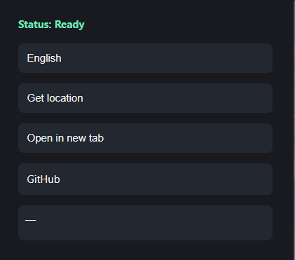
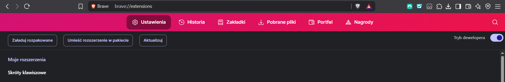
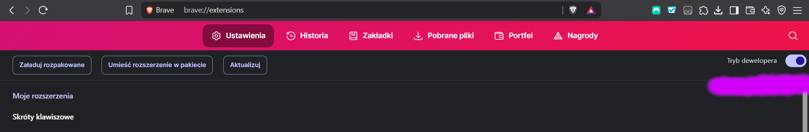
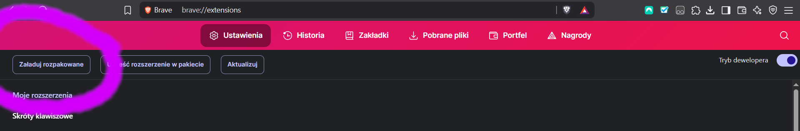

# OpenGuesser-Cheats
OpenGuesser Cheats is a browser extension that allows you to fetch your current location, display the country and city you're in, or open a preview on the map.

## **1. How the Extension Works**
On the OpenGuessr website, there is an iframe that loads an image from Google Maps to display it on your screen. Since this is not secured in any way, the extension searches for this HTML element on the page, retrieves the coordinates assigned to the iframe, and then looks up the corresponding city and country, displaying this information inside the extension.

## **2. How to Use the Extension**
**This extension includes four buttons: (see image below)**

**1.**  The first button switches the language to English or Polish. However, it's recommended to use English, as country names on the map are in English, making it easier to find specific locations.

**2.**  The second button, "Fetch Location," shows in the window below which country you are currently in. Remember to click this button only after the iframe has fully loaded; otherwise, an error may occur indicating that the location could not be found.

**3.** The third button opens the exact location you’re in on a new tab, but this can only be done after retrieving the location using the previous function.

**4.** The fourth button is not a feature of the extension itself, but simply a redirect to the extension’s GitHub repository.

## **3. How to install**

**1.** Download this repository to your computer.

**2.** Open a browser, e.g., Chrome or Brave.

**3.** Enter the following address: 'chrome://extensions' (see image below).

**4.** Click the "Enable Developer Mode" button (see image below).

**5.** Then add the unpacked extension (see image below).

You can now pin your extension to keep it always visible and launch it whenever you want.
